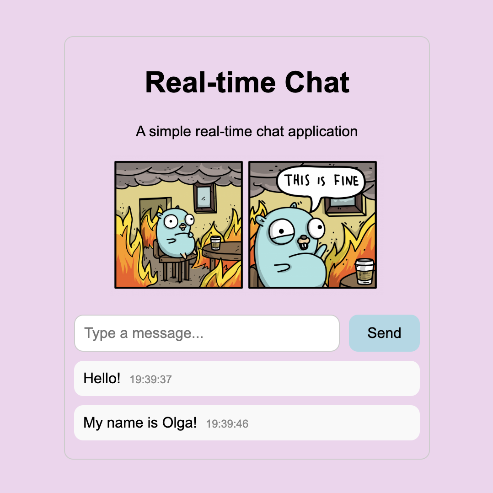
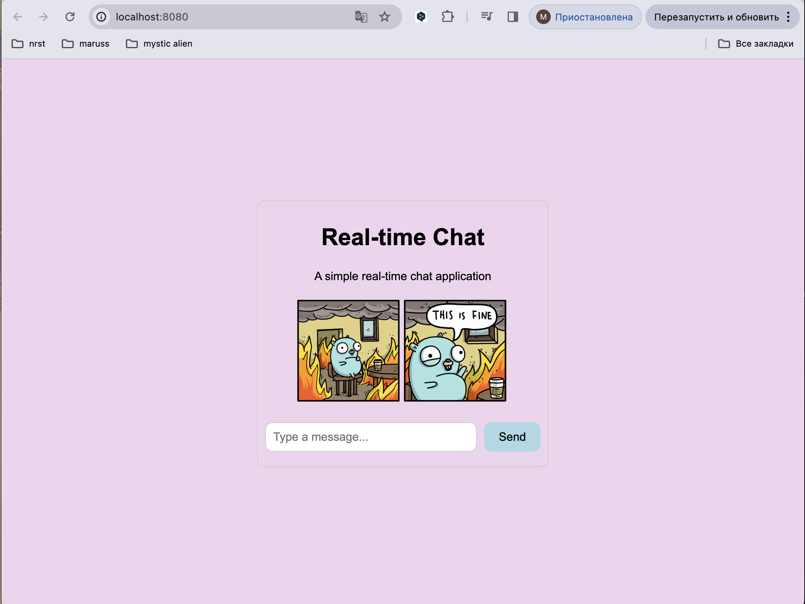

# Real-Time Chat Application

This is a simple real-time chat application built with Go (Golang) and WebSocket.

## Features

- Real-time communication
- Simple user interface
- Easy to deploy

## Installation

1. Make sure you have Go installed on your system. If not, you can download and install it from [the official Go website](https://golang.org/dl/).
2. Clone this repository: `git clone https://github.com/your_username/real-time-chat.git`
3. Navigate to the project directory: `cd real-time-chat`
4. Run the server: `go run main.go`
5. Open your web browser and go to `http://localhost:8080` to access the chat application.

## Usage

- Type your message in the input field and press "Send" to send it.
- All connected clients will receive your message in real-time.

## Contributing

Contributions are welcome! If you find any issues or have suggestions for improvement, please open an issue or create a pull request.
